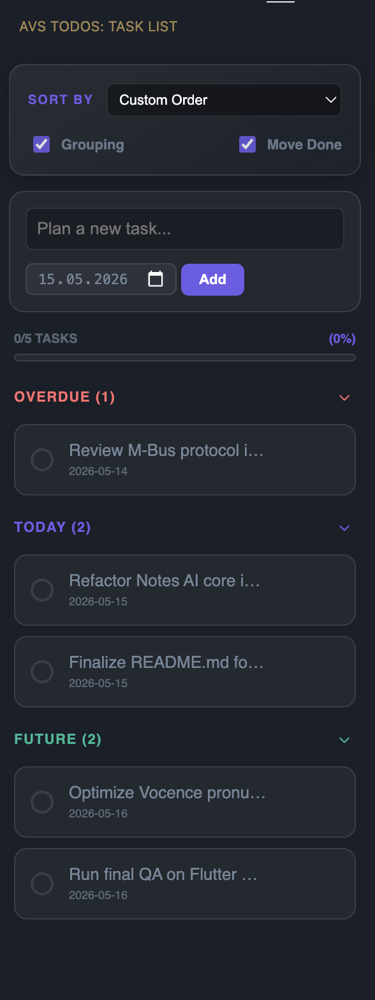

# AVS Todos - Advanced Project Task Manager

**AVS Todos** is a professional, high-performance VS Code extension designed for developers who need to manage project-specific tasks with a git-friendly workflow and a premium UI.

---

## ✨ Features

- **📂 Task Portability & Backup**: Unlike other extensions, AVS Todos stores data in a local `avstodos` file in your project root. **Your tasks follow your code.** Commit them to Git to sync with your team or keep a versioned history of your progress.
- **📁 Collapsible Smart Grouping**: Tasks are automatically organized into **Overdue, Today, Future, and Completed**. Each section is collapsible (accordion style) to keep your sidebar clean and focused.
- **📊 Dynamic Progress Tracking**: A sleek, gradient progress bar visualizes your completion ratio in real-time (e.g., 11/18 Tasks - 61%).
- **↕️ Custom Drag-and-Drop**: Fully interactive manual sorting. Organize your priorities exactly how you want them by simply dragging the cards.
- **🎨 Premium Interface**: Modern glassmorphism design with custom animations, theme-aware icons (Dark/Light), and a responsive layout.
- **🌍 Global & Professional**: Fully localized in English with high-standard technical terminology.

---

## 📸 Screenshot

---

## 🛠️ Working Principle

AVS Todos is built with performance and transparency in mind:

### Architecture
- **WebviewView Provider**: Implements the `vscode.WebviewViewProvider` API for a seamless sidebar experience.
- **Bi-directional Bridge**: Uses a robust `postMessage` protocol to sync UI actions (drag-drop, toggle, edit) with the backend instantly.
- **Local Persistence**: Directly reads/writes to a JSON-formatted file in the project directory. This means **no cloud, no data loss, and zero configuration.**

### Performance
- **Zero-Latency UI**: Built with pure TypeScript and modern CSS (no heavy frameworks) for instant responsiveness.
- **Theme Awareness**: Automatically adapts to VS Code's Dark, Light, and High Contrast themes.

---

## 🚀 Getting Started

### Installation
1. Search for **"AVS Todos"** in the VS Code Marketplace.
2. Click **Install**.
3. Click the **AVS Todos** icon in your Activity Bar to start planning.

### How to Use
- **Add Task**: Enter your plan, select a date, and press **Enter**.
- **Collapse Groups**: Click on any group header (e.g., "Today") to expand or collapse it.
- **Reorder**: Drag any task card to change its position manually.
- **Toggle Status**: Click anywhere on a task card to mark it as complete.
- **Quick Actions**: Hover over a card to access the **✎ Edit** and **× Delete** buttons.

---

## 📝 License

This project is licensed under the MIT License.

Made by [Ahmet Veysel](https://ahmetveysel.com).